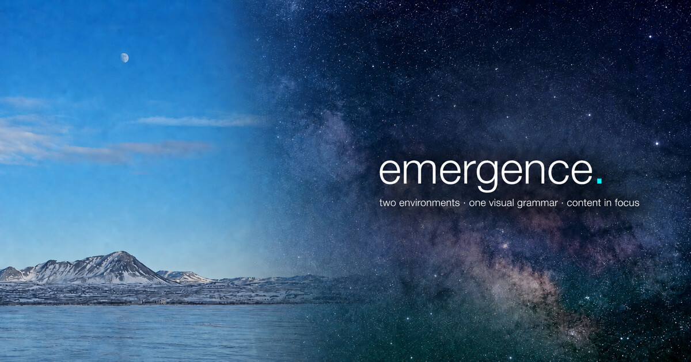

# emergence

An image-led Jekyll design system for portfolios, notes, and reading lists.
Glacier is the light environment; Galaxy is the dark environment.
Both use the same calm structure, content contracts, and accessible
interactions.

[](presets/glacier-stellar/)

The checked-out repository is a complete anonymous demo. It contains generic
design-system specimens rather than a person's name, contact details, profile,
or subject-area portfolio.

## Try it now

Requirements: Ruby 3.x and Bundler.

```bash
git clone <repository-url> emergence
cd emergence
./bin/preview
```

Open <http://localhost:4000>. The command checks dependencies, installs them
when needed, and starts Jekyll with live reload and a local root path.

To inspect the site on a phone connected to the same Wi-Fi, expose the preview
to the local network:

```bash
PREVIEW_HOST=0.0.0.0 PREVIEW_LIVERELOAD=0 ./bin/preview
```

Then open `http://<your-computer-local-IP>:4000` on the phone. Keep the preview
local to a trusted network. If a port is already in use, choose another one
with `PREVIEW_PORT`; LiveReload can also use a separate
`PREVIEW_LIVERELOAD_PORT`.

The demo includes:

- image-led Glacier and Galaxy environments with a persistent theme toggle
- projects covering completed, in-progress, and planned states
- Notes and Readings collection indexes
- long-form pages with a table of contents and related-content patterns
- an About page that explains the system without presenting a person

## Design references

- [DESIGN.md](DESIGN.md) — the neutral editorial foundation
- [Glacier / Galaxy DESIGN.md](presets/glacier-stellar/DESIGN.md) — the active image-led visual grammar
- [COMPONENTS.md](COMPONENTS.md) — reusable component inventory
- [tokens/](tokens/) — portable neutral token export
- [preset tokens](presets/glacier-stellar/tokens/) — portable Glacier / Galaxy token export

The active checkout already has the Glacier / Galaxy preset applied. The
installer remains as an idempotent way to restore those files after
experimentation:

```bash
./presets/glacier-stellar/install.sh
```

It replaces active visual tokens, Sass partials, layouts, collection indexes,
homepage composition, background imagery, and the social preview. Content and
collection contracts remain in place.

## Use it as a template

1. Use this repository as a template or copy its files.
2. Replace the generic site metadata in `_config.yml`.
3. Replace `_data/profile.yml` only if the site needs an identity-based About page.
4. Remove the demo entries under `_projects/`, `_notes/`, and `_readings/`.
5. Run `./bin/check-public` before publishing.

Comments and external social links are disabled by default. Add them
deliberately only after configuring the destination repository or profile.

### Project contract

Projects use folder pages such as `_projects/example/index.md`.

```yaml
---
title: "Project title"
description: "One-line description"
tags: [Design, Web, Documentation]
order: 1
status: completed
project_type: systems
---
```

- `status`: `completed`, `in-progress`, or `planned`
- `project_type`: `research` or `systems`
- completed entries link to their detail page when `link` is omitted
- `published: false` hides a draft

### Notes and Readings

Notes live under `_notes/<subcategory>/` and Readings under
`_readings/<subcategory>/`. Any non-empty `subcategory` is grouped
automatically.

```yaml
---
title: "Entry title"
date: 2026-01-01 00:00:00 +0000
description: "Short preview text"
subcategory: design
tags: [typography, layout]
toc: true
---
```

## Customize the visual system

Active environment tokens live in:

- `_data/theme_dark.yml`
- `_data/theme_light.yml`
- `_sass/emergence/_variables.scss` as matching fallbacks

Page and component rules live under `_sass/emergence/`. The
`assets/css/emergence.scss` file is only the Sass entrypoint; add rules to the
partials, not the entrypoint.

Background delivery uses JPEG fallbacks plus 1920px and 3840px AVIF/WebP
variants. Keep `bg-image` and `bg-image-fallback` synchronized when replacing
those assets.

## Validate

```bash
LANG=en_US.UTF-8 bundle exec jekyll build
bundle exec htmlproofer _site --disable-external
./bin/check-public
```

`check-public` scans both repository text and the generated site for private
identity markers and subject-specific demo residue. It also checks distributed
images for embedded creator, device, location, or capture metadata.

## Deploy

The included GitHub Actions workflow builds, validates, checks the public
surface, and deploys through GitHub Pages on pushes to `main`. Enable
**Settings → Pages → Source → GitHub Actions** in the destination repository.

Repository ownership and Git commit authorship are separate from site content.
If anonymous maintainership is required, publish this sanitized working tree
with a clean history from a neutral account or organization.

## License

Code is available under the [MIT License](LICENSE). The bundled photographs and
composite preview have separate terms in
[ASSET-LICENSES.md](presets/glacier-stellar/ASSET-LICENSES.md).
